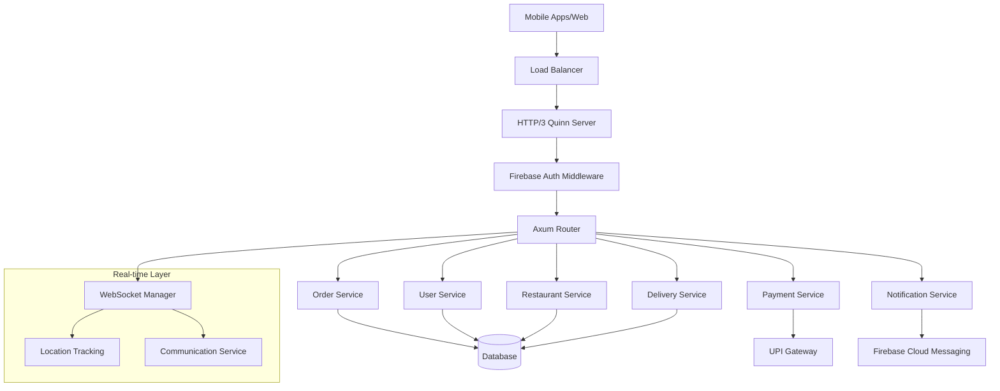
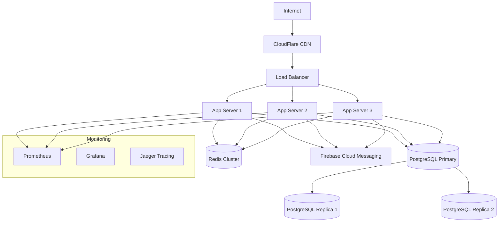

# Multi-Vendor Delivery Server Enhancement Design

## Overview

This design document outlines the architecture for a high-performance HTTP/3 multi-vendor delivery server built with Rust. The system supports real-time order management, Firebase authentication with dual verification, FCM push notifications using modern OAuth, UPI-based payments with refund capabilities, and comprehensive user management across customers, restaurants, and delivery personnel.

## Architecture

### High-Level Architecture



### Technology Stack

| Component | Technology | Purpose |
|-----------|------------|---------|
| **HTTP Server** | Quinn + H3 | HTTP/3 QUIC protocol support |
| **Web Framework** | Axum | Async HTTP routing and middleware |
| **Runtime** | Tokio | Async execution and concurrency |
| **Authentication** | Firebase Auth | JWT token verification |
| **Database** | PostgreSQL/MongoDB | Persistent data storage |
| **Notifications** | FCM OAuth | Push messaging service |
| **Payments** | UPI Integration | Indian payment processing |
| **Real-time** | WebSockets | Live updates and tracking |
| **Serialization** | Serde | JSON/data handling |
| **Logging** | Tracing | Structured observability |

## Components and Interfaces

### 1. HTTP/3 Server Layer

**Purpose**: Handle QUIC connections and HTTP/3 protocol implementation

**Key Components**:
- `Server`: Main server struct managing Quinn endpoint
- `Http2Server`: Fallback for development/testing
- `ConnectionHandler`: Manages individual QUIC connections
- `RequestHandler`: Converts H3 requests to Axum format

**Interfaces**:
```rust
pub struct Server {
    config: Config,
    firebase_auth: SharedFirebaseAuth,
    services: SharedServices,
}

impl Server {
    pub fn new(config: Config) -> Result<Self>;
    pub async fn run(self) -> Result<()>;
    async fn handle_connection(conn: quinn::Connecting, app: Router) -> Result<()>;
    async fn handle_request(req: Request<()>, stream: RequestStream, app: Router) -> Result<()>;
}
```

### 2. Authentication Service

**Purpose**: Firebase JWT verification with dual email/phone validation

**Key Components**:
- `FirebaseAuth`: Token verification against Google public keys
- `AuthMiddleware`: Request authentication and user extraction
- `UserValidator`: Email and phone verification requirements

**Interfaces**:
```rust
pub struct FirebaseAuth {
    client: Client,
    project_id: String,
    public_keys: HashMap<String, String>,
}

impl FirebaseAuth {
    pub async fn verify_token(&self, token: &str) -> Result<User>;
    pub async fn refresh_public_keys(&mut self) -> Result<()>;
    pub fn validate_user_requirements(&self, user: &User) -> Result<()>;
}
```

### 3. Notification Service

**Purpose**: Modern FCM integration using OAuth 2.0 service accounts

**Key Components**:
- `FCMService`: OAuth-based notification delivery
- `NotificationQueue`: Async batch processing
- `TemplateEngine`: Role-based message customization

**Interfaces**:
```rust
pub struct FCMService {
    client: Client,
    project_id: String,
    service_account_key: ServiceAccountKey,
    access_token: Option<String>,
    token_expires_at: Option<DateTime<Utc>>,
}

impl FCMService {
    pub async fn send_notification(&mut self, token: &str, payload: &NotificationPayload) -> Result<()>;
    pub async fn send_bulk_notifications(&mut self, notifications: Vec<(String, NotificationPayload)>) -> Result<()>;
    async fn get_access_token(&mut self) -> Result<String>;
}
```

### 4. Order Management Service

**Purpose**: Complete order lifecycle from placement to delivery

**Key Components**:
- `OrderService`: CRUD operations and status management
- `OrderStateMachine`: Status transition validation
- `OrderNotifier`: Automatic notification triggers

**Interfaces**:
```rust
pub struct OrderService {
    db: Arc<dyn DatabaseConnection>,
    fcm: Arc<Mutex<FCMService>>,
    payment: Arc<PaymentService>,
}

impl OrderService {
    pub async fn create_order(&self, request: CreateOrderRequest, user: &User) -> Result<Order>;
    pub async fn update_status(&self, order_id: Uuid, status: OrderStatus, user: &User) -> Result<Order>;
    pub async fn get_order(&self, order_id: Uuid, user: &User) -> Result<Order>;
    pub async fn list_orders(&self, user: &User, filters: OrderFilters) -> Result<Vec<Order>>;
}
```

### 5. Payment Service

**Purpose**: UPI-based payment processing with refund capabilities

**Key Components**:
- `PaymentService`: Transaction processing
- `UPIGateway`: Integration with UPI payment providers
- `RefundManager`: Automatic refund processing

**Interfaces**:
```rust
pub struct PaymentService {
    upi_gateway: Arc<dyn UPIGateway>,
    db: Arc<dyn DatabaseConnection>,
}

impl PaymentService {
    pub async fn process_payment(&self, request: PaymentRequest) -> Result<PaymentResponse>;
    pub async fn process_refund(&self, order_id: Uuid, reason: RefundReason) -> Result<RefundResponse>;
    pub async fn get_payment_status(&self, payment_id: Uuid) -> Result<PaymentStatus>;
}
```

### 6. User Management Service

**Purpose**: Comprehensive user lifecycle management

**Key Components**:
- `UserService`: Profile management and role handling
- `ProfileValidator`: Data validation and verification
- `RoleManager`: Permission-based access control

**Interfaces**:
```rust
pub struct UserService {
    db: Arc<dyn DatabaseConnection>,
    firebase_auth: Arc<Mutex<FirebaseAuth>>,
}

impl UserService {
    pub async fn create_user(&self, firebase_user: &FirebaseUser) -> Result<User>;
    pub async fn update_profile(&self, user_id: Uuid, updates: ProfileUpdates) -> Result<User>;
    pub async fn get_user(&self, user_id: Uuid) -> Result<User>;
    pub async fn verify_requirements(&self, user_id: Uuid) -> Result<VerificationStatus>;
}
```

### 7. Restaurant Management Service

**Purpose**: Restaurant operations and menu management

**Key Components**:
- `RestaurantService`: Business profile management
- `MenuService`: Menu item and pricing management
- `AvailabilityManager`: Operating hours and capacity

**Interfaces**:
```rust
pub struct RestaurantService {
    db: Arc<dyn DatabaseConnection>,
    menu_service: Arc<MenuService>,
}

impl RestaurantService {
    pub async fn register_restaurant(&self, request: RestaurantRegistration) -> Result<Restaurant>;
    pub async fn update_menu(&self, restaurant_id: Uuid, menu_updates: MenuUpdates) -> Result<Menu>;
    pub async fn set_availability(&self, restaurant_id: Uuid, available: bool) -> Result<()>;
    pub async fn get_orders(&self, restaurant_id: Uuid, filters: OrderFilters) -> Result<Vec<Order>>;
}
```

### 8. Delivery Management Service

**Purpose**: Delivery person management and assignment

**Key Components**:
- `DeliveryService`: Delivery person lifecycle
- `AssignmentEngine`: Intelligent order assignment
- `LocationTracker`: Real-time location management

**Interfaces**:
```rust
pub struct DeliveryService {
    db: Arc<dyn DatabaseConnection>,
    location_service: Arc<LocationService>,
}

impl DeliveryService {
    pub async fn register_delivery_person(&self, request: DeliveryRegistration) -> Result<DeliveryPerson>;
    pub async fn assign_order(&self, order_id: Uuid) -> Result<Assignment>;
    pub async fn update_location(&self, delivery_id: Uuid, location: Location) -> Result<()>;
    pub async fn complete_delivery(&self, delivery_id: Uuid, proof: DeliveryProof) -> Result<()>;
}
```

### 9. Real-time Communication Layer

**Purpose**: WebSocket-based real-time updates

**Key Components**:
- `WebSocketManager`: Connection lifecycle management
- `LocationBroadcaster`: Real-time location updates
- `ChatService`: In-app communication

**Interfaces**:
```rust
pub struct WebSocketManager {
    connections: Arc<RwLock<HashMap<Uuid, WebSocketConnection>>>,
    message_queue: Arc<MessageQueue>,
}

impl WebSocketManager {
    pub async fn connect_user(&self, user_id: Uuid, ws: WebSocket) -> Result<()>;
    pub async fn broadcast_to_order(&self, order_id: Uuid, message: Message) -> Result<()>;
    pub async fn send_location_update(&self, user_id: Uuid, location: Location) -> Result<()>;
}
```

## Data Models

### Core Entities

```rust
// User Management
#[derive(Debug, Serialize, Deserialize)]
pub struct User {
    pub id: Uuid,
    pub firebase_uid: String,
    pub email: String,
    pub phone: String,
    pub email_verified: bool,
    pub phone_verified: bool,
    pub role: UserRole,
    pub profile: UserProfile,
    pub created_at: DateTime<Utc>,
    pub updated_at: DateTime<Utc>,
}

#[derive(Debug, Serialize, Deserialize)]
pub enum UserRole {
    Customer,
    Restaurant,
    DeliveryPerson,
    Admin,
}

// Order Management
#[derive(Debug, Serialize, Deserialize)]
pub struct Order {
    pub id: Uuid,
    pub customer_id: Uuid,
    pub restaurant_id: Uuid,
    pub delivery_person_id: Option<Uuid>,
    pub items: Vec<OrderItem>,
    pub status: OrderStatus,
    pub total_amount: f64,
    pub delivery_address: Address,
    pub restaurant_address: Address,
    pub payment_id: Option<Uuid>,
    pub created_at: DateTime<Utc>,
    pub updated_at: DateTime<Utc>,
    pub estimated_delivery_time: Option<DateTime<Utc>>,
}

#[derive(Debug, Serialize, Deserialize)]
pub enum OrderStatus {
    Placed,
    Confirmed,
    Preparing,
    Ready,
    PickedUp,
    InTransit,
    Delivered,
    Cancelled,
    Refunded,
}

// Payment Management
#[derive(Debug, Serialize, Deserialize)]
pub struct Payment {
    pub id: Uuid,
    pub order_id: Uuid,
    pub user_id: Uuid,
    pub amount: f64,
    pub currency: String,
    pub payment_method: PaymentMethod,
    pub upi_transaction_id: Option<String>,
    pub status: PaymentStatus,
    pub created_at: DateTime<Utc>,
    pub completed_at: Option<DateTime<Utc>>,
}

#[derive(Debug, Serialize, Deserialize)]
pub enum PaymentMethod {
    UPI { vpa: String },
    Card { last_four: String },
    Wallet { provider: String },
}

// Location and Tracking
#[derive(Debug, Serialize, Deserialize)]
pub struct Location {
    pub latitude: f64,
    pub longitude: f64,
    pub accuracy: Option<f64>,
    pub timestamp: DateTime<Utc>,
}

#[derive(Debug, Serialize, Deserialize)]
pub struct Address {
    pub street: String,
    pub city: String,
    pub state: String,
    pub postal_code: String,
    pub country: String,
    pub latitude: Option<f64>,
    pub longitude: Option<f64>,
}
```

## Error Handling

### Error Types

```rust
#[derive(Debug, thiserror::Error)]
pub enum AppError {
    #[error("Authentication failed: {0}")]
    Authentication(String),
    
    #[error("Authorization failed: {0}")]
    Authorization(String),
    
    #[error("Validation error: {0}")]
    Validation(String),
    
    #[error("Database error: {0}")]
    Database(#[from] DatabaseError),
    
    #[error("Payment processing failed: {0}")]
    Payment(String),
    
    #[error("Notification delivery failed: {0}")]
    Notification(String),
    
    #[error("Internal server error: {0}")]
    Internal(#[from] anyhow::Error),
}
```

### Error Response Format

```rust
#[derive(Debug, Serialize)]
pub struct ErrorResponse {
    pub error: String,
    pub message: String,
    pub code: u16,
    pub timestamp: DateTime<Utc>,
    pub request_id: Option<String>,
}
```

## Testing Strategy

### Unit Testing
- **Service Layer**: Mock database and external dependencies
- **Authentication**: Test token validation and user requirements
- **Payment Processing**: Mock UPI gateway responses
- **Notification Service**: Test FCM OAuth flow and message formatting

### Integration Testing
- **API Endpoints**: Full request/response cycle testing
- **Database Operations**: Real database with test data
- **Firebase Integration**: Test environment Firebase project
- **WebSocket Communication**: Real-time message delivery

### Load Testing
- **HTTP/3 Performance**: Concurrent connection handling
- **Database Scalability**: Connection pooling and query performance
- **Notification Throughput**: Bulk message delivery capacity
- **Real-time Updates**: WebSocket connection limits

### Security Testing
- **Authentication Bypass**: Invalid token handling
- **Authorization Checks**: Role-based access control
- **Input Validation**: SQL injection and XSS prevention
- **Rate Limiting**: API abuse protection

## Deployment Architecture

### Production Environment



### Container Configuration

```dockerfile
# Multi-stage production build
FROM rust:1.75 as builder
WORKDIR /app
COPY . .
RUN cargo build --release

FROM debian:bookworm-slim
RUN apt-get update && apt-get install -y ca-certificates libssl3
COPY --from=builder /app/target/release/server /usr/local/bin/server
EXPOSE 8443
CMD ["server"]
```

### Kubernetes Deployment

```yaml
apiVersion: apps/v1
kind: Deployment
metadata:
  name: delivery-server
spec:
  replicas: 3
  selector:
    matchLabels:
      app: delivery-server
  template:
    metadata:
      labels:
        app: delivery-server
    spec:
      containers:
      - name: server
        image: delivery-server:latest
        ports:
        - containerPort: 8443
        env:
        - name: DATABASE_URL
          valueFrom:
            secretKeyRef:
              name: db-secret
              key: url
        resources:
          requests:
            memory: "256Mi"
            cpu: "250m"
          limits:
            memory: "512Mi"
            cpu: "500m"
```

## Performance Considerations

### Scalability Targets
- **Concurrent Users**: 10,000+ simultaneous connections
- **Request Throughput**: 1,000+ requests per second
- **Database Performance**: Sub-100ms query response times
- **Notification Delivery**: 95% delivery within 5 seconds
- **Real-time Updates**: Sub-second WebSocket message delivery

### Optimization Strategies
- **Connection Pooling**: Efficient database connection management
- **Caching Layer**: Redis for frequently accessed data
- **Async Processing**: Non-blocking I/O for all operations
- **Batch Operations**: Bulk notification and database operations
- **CDN Integration**: Static asset delivery optimization

## Security Measures

### Authentication Security
- **JWT Validation**: Verify signatures against Google public keys
- **Token Expiration**: Enforce reasonable token lifetimes
- **Dual Verification**: Require both email and phone verification
- **Rate Limiting**: Prevent authentication brute force attacks

### Data Protection
- **Encryption in Transit**: TLS 1.3 for all communications
- **Encryption at Rest**: Database-level encryption
- **PII Handling**: Minimal data collection and secure storage
- **Audit Logging**: Comprehensive access and modification logs

### API Security
- **Input Validation**: Strict request payload validation
- **SQL Injection Prevention**: Parameterized queries only
- **CORS Configuration**: Restrictive cross-origin policies
- **Request Size Limits**: Prevent DoS through large payloads

## Monitoring and Observability

### Metrics Collection
- **Application Metrics**: Request rates, response times, error rates
- **System Metrics**: CPU, memory, disk, network utilization
- **Business Metrics**: Order volumes, payment success rates, user activity
- **Custom Metrics**: Service-specific performance indicators

### Logging Strategy
- **Structured Logging**: JSON format with consistent fields
- **Log Levels**: Appropriate use of debug, info, warn, error
- **Correlation IDs**: Request tracing across service boundaries
- **Sensitive Data**: Careful handling of PII in logs

### Alerting Rules
- **Error Rate Thresholds**: Alert on elevated error percentages
- **Response Time Degradation**: Monitor for performance issues
- **Service Availability**: Health check failure notifications
- **Business Impact**: Critical order flow disruptions

This comprehensive design provides the foundation for implementing a production-ready multi-vendor delivery server with modern architecture patterns, security best practices, and scalability considerations.